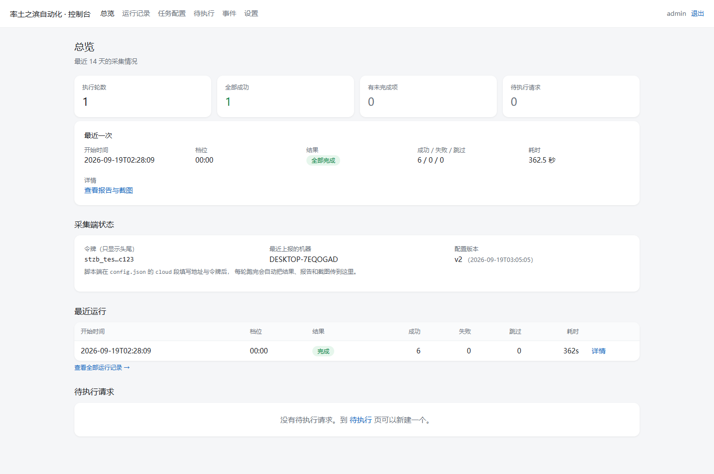
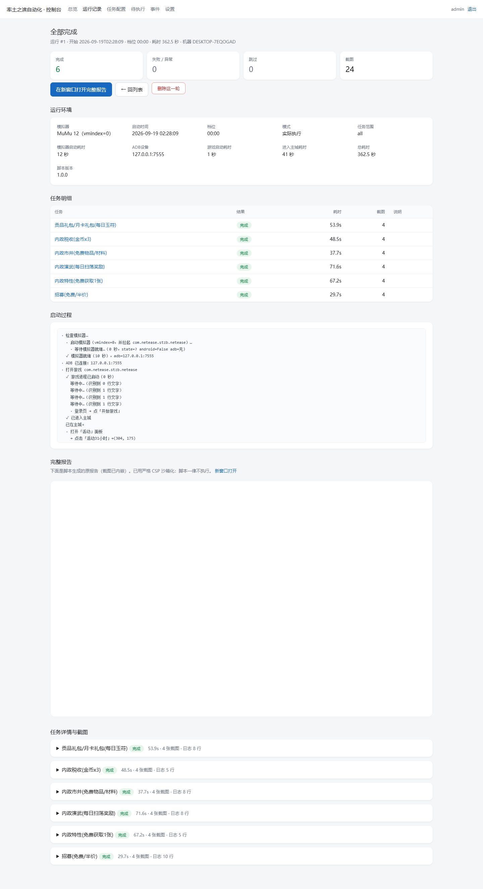
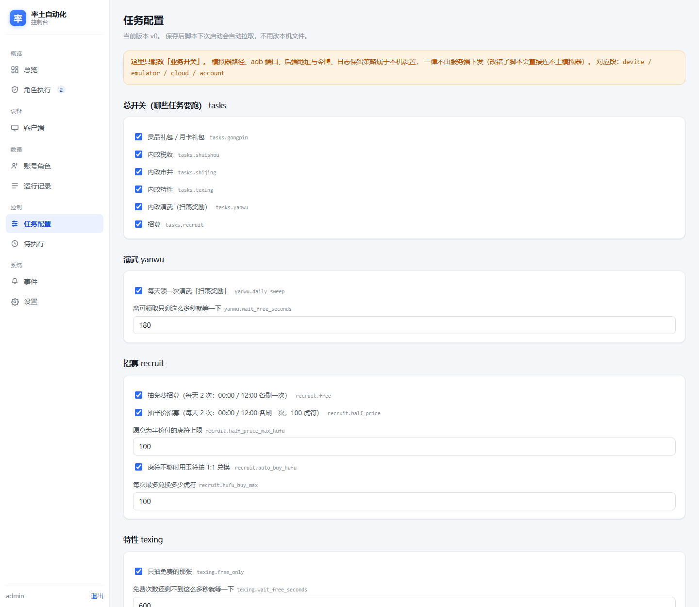

# 率土之滨 · 每日任务自动化

一台 Windows 电脑 + 一个 MuMu 模拟器，自动完成《率土之滨》里的六个每日任务：
贡品礼包、税收、市井、演武、特性、招募 —— 跑完生成一份**带游戏截图的报告**，
可选推送到一个自建的 Web 控制台，在手机/别的电脑上也能看结果、改配置、排下一次任务。

**支持多台机器、多个账号、多个角色**：后端（公网）统一管理账号/角色并**动态指派**，
采集端（内网）下次心跳就会领到指派、自动免密切换到指定账号与角色；后端还能看到
每台机器是否在线、一键「探测」它此刻的真实界面。

> ⚠️ 本项目仅用于个人学习 Windows 桌面自动化（ADB + OCR + 图像识别），
> 请遵守游戏用户协议，风险自担。

---

## 功能

**采集端（跑在你玩游戏的这台 Windows 电脑上）**

- 自动冷启动：MuMu 没开就自己拉起来 → 等 Android 就绪 → 打开游戏 → 点掉登录页 → 进主城
- 六个每日任务，每个都有多重判据（OCR / 颜色指纹 / 几何特征）与安全阀
- 每一步截图留证，跑完生成**自包含单文件 HTML 报告**（截图内嵌，拷走不裂）
- 三种运行模式：
  - **独立运行**（默认）—— 不连任何外部服务，报告只留在本机
  - **后端托管** —— 启动时拉配置、领任务，跑完上传结果与截图
  - `--offline` 临时脱离后端，一个字节都不外发
- **账号/角色自动切换**（后端托管下）：按后端指派，在登录页免密切到指定账号与角色
- 单实例锁，两个进程不会同时操控模拟器
- 花钱项（半价招募）有三道安全阀，原价一律拒抽
- **常驻探活进程 `agent.py`**：只做心跳 + 接指令，不做任务，让机器全天在线可被指派

**后端控制台（部署在你自己的服务器）**

- 运行历史、每轮详情（任务明细 + 日志 + 截图 + 内嵌报告）
- **客户端在线探活**：心跳式判在线/掉线，附设备状态与最近界面
- **账号 / 角色管理**：登记多个游戏账号与角色，指派给任意客户端的任意角色
- **一键探测**：下发一次性指令，客户端下次心跳执行（读屏 / 截图）并把结果回传
- **定向任务**：把任务只派给指定客户端；不指定就是公共任务，谁先来谁领
- 远程改任务配置（带版本历史，可回滚）
- 排「待执行任务」，脚本下次启动会领走
- 口令/令牌只存 scrypt 哈希；上传的报告用严格 CSP 沙箱化

---

## 多账号 / 多角色是怎么协作的

核心矛盾：**后端在公网，采集端在内网** —— 服务端**没法主动连**客户端。
所以「探活」和「指派」都必须是客户端**主动上报**的形式：

```text
采集端(内网)                             后端(公网)
    │  POST /api/agent/ping  ───────────►  记 last_seen / IP / 版本 / 设备
    │  （每 30 秒一次，带稳定 uid）          │
    │                                       │  90 秒没心跳 → 判掉线
    │  ◄───── assignment（指派哪个账号/角色）
    │         + switch_needed（要不要切）
    │         + command（待执行的探测指令）
    │
    │  按指派切换账号/角色 → 跑任务 → 上传结果
```

- **在线判定**：客户端每 30 秒心跳一次，服务端记录 `last_seen`；超过 90 秒没来就是掉线。
  页面上的在线/掉线是**按时间算出来的**，不依赖服务端去连客户端。
- **动态指派**：后端把「某客户端 → 某账号 + 某角色」写进库里。客户端心跳时拿到
  `assignment`，发现自己不在目标账号/角色上就 `switch_needed=true`，于是先切换再跑任务。
  **不用改客户端配置文件**，全在后端点几下就生效。
- **一键探测**：服务端把指令挂在客户端那条记录上（`probe_json`），客户端下次心跳取走、
  执行（读当前屏幕文字 / 截图）、再回报。这样「服务端连不上内网」也不再是障碍。

### 账号切换的能力边界（重要）

- **换角色 / 换区服 —— 完全免密**：登录页「点击换区」→ 选服务器面板 → 点角色 → 确定。
- **换账号 —— 免密，但只能用「这台机器登录过的」账号**：走「用户中心 → 切换账号」会落到
  网易统一登录页，上面只有「常用」列表（= 本机登录过的账号），点一下再点「登录」就切过去了。
- 所以约定是：**每个要自动切换的账号，至少在这台机器的模拟器里手动登录过一次。**
  系统**不保存任何密码**，也**不会**去点「其他账号登录」「提交并退出」这类危险按钮。
- 要切一个从没在这台机器登过的账号 → 系统会**如实报「需要先手动登录一次」**，不会瞎点。

---

## 界面与截图

**后端控制台 · 总览** —— 最近 14 天统计、最近一次结果、采集端状态



**运行详情** —— 每个任务的结果、耗时、执行日志与游戏截图，内嵌完整报告



**任务配置** —— 远程改任务开关与参数，带版本历史可回滚



**游戏截图**（自动跑的时候留下的证据）

| 演武 · 扫荡奖励弹窗 | 特性面板 |
|---|---|
|  |  |

---

## 快速开始（采集端）

### 0. 前置条件

| 需要 | 说明 |
|---|---|
| Windows 10/11 | |
| [MuMu 模拟器 12](https://mumu.163.com/) | 装好后把《率土之滨》装进模拟器 |
| [Python 3.11+](https://www.python.org/downloads/) | 安装时勾选 **Add to PATH** |

### 1. 克隆 + 装环境

```bat
git clone https://github.com/你的用户名/stzb-automation.git
cd stzb-automation
setup.bat
```

`setup.bat` 会在项目里建一个 `venv\` 并装好依赖（opencv / winrt OCR / numpy / certifi），
所有 `.bat` 启动器都会优先用它 —— 不污染系统 Python。

### 2. 配置

双击 **`config_tool.bat`**，全中文菜单：

- 「模拟器与 ADB」—— 默认会自动探测 MuMu 安装路径，装在默认位置就不用改
- 「后端托管」—— 想绑定服务器就在这里填地址和令牌（会当场验证）；
  **不填就是独立运行**，脚本不连任何外部服务

### 3. 跑一次

双击 **`run_now.bat`**。它会：冷启动模拟器 → 开游戏 → 进主城 → 跑任务 →
关模拟器 → 生成报告并自动打开浏览器。

报告在 `logs\reports\latest.html`，双击就能看（截图已内嵌在文件里）。

### 4. 以后怎么跑

| 场景 | 做法 |
|---|---|
| 手动跑一次 | 双击 `run_now.bat` |
| 让你自己的定时开机/计划任务来跑 | 调 `run_daily.bat`（静默，输出进 `logs\console.log`） |
| 临时脱离后端跑一次 | `run_daily.py --offline` |
| 只跑某个任务 | `run_daily.py --only yanwu --force` |
| 看后端给我派了什么账号/角色 | `run_daily.py --whoami` |
| 先切账号角色试试、不真跑任务 | `run_daily.py --no-switch` 关切换 / 或看下面「常驻探活」 |

### 5. 让这台机器全天在线（可选，多机管理必看）

`run_daily.py` 一天只跑两档（00:00 / 12:00），其余 20 多个小时后端是看不到它的 ——
想随时指派、随时探测，就再起一个**常驻探活进程**：

```bat
rem 一直挂着（最小化窗口即可），只做心跳和接指令，不跑任务
venv\Scripts\python.exe agent.py
```

| 参数 | 作用 |
|---|---|
| `--once` | 只跑一轮心跳就退出（排查用） |
| `--interval 30` | 心跳间隔秒数（默认取服务端下发的值） |
| `--no-probe` | 只心跳，不执行探测指令（不想让后台读屏时用） |
| `--quiet` | 少打印 |

日志写在 `logs\agent.log`。它和后端「客户端」页里那条记录共用同一个稳定 uid
（存在 `state\client.json`），所以后台看到的始终是同一台机器。

---

## 部署后端控制台（可选）

不部署也完全能用 —— 采集端默认就是独立运行。
部署后多的是：**在外面看结果、远程改配置、排下一次任务**。

| 部署方式 | 适合 | 说明 |
|---|---|---|
| **Docker Compose（Debian/Ubuntu）** | 公网服务器（推荐） | 应用 + Caddy 自动 HTTPS，一条命令起全套 |
| **Windows 裸机** | 自己家里/办公室的机器 | `setup_server.bat` + `start_server.bat` |
| **Linux 裸机** | 不想用 Docker | systemd + 反代 |

详细步骤见 **[server/README.md](server/README.md)**（三种方式都有）。

绑定：采集端双击 `config_tool.bat` → 「后端托管」→ 填服务器地址与令牌 →
它会**当场验证**，通过才写入。

---

## 六个每日任务

| 任务 | 做什么 | 刷新点 |
|---|---|---|
| 贡品礼包 | 进「活动 → 充值好礼 → 贡品礼包」核对月卡 | —（月卡自动发放） |
| 内政税收 | 领金币，每天 3 次；**绝不点**花虎符的「强征」 | 00:00 |
| 内政市井 | 领宝物商队免费物品；用铜钱买指定材料 | 00:00 |
| 内政演武 | 领右下角「扫荡奖励」（纯领取，不花货币） | 00:00 |
| 内政特性 | 抽「获取1张」免费的那张；花玉符的一律不抽 | 12:00 |
| 招募 | 先抽免费，再按配置抽半价 | **00:00 和 12:00 各刷一次**（每天 2 免费 + 2 半价） |

任务挂在 `00:00` 和 `12:00` 两个档位（`run_daily.py --list` 可看）。
12:00 档多数任务会显示「已领过 / 冷却中」，那是**正常结果**。

---

## 安全设计

**花钱的事只在这些条件下发生：**

- 招募半价：必须同时满足「按钮左边缘有红色『打折』丝带（或卡包列写『半价1次』）」
  **且**「读到的价格 ≤ `recruit.half_price_max_hufu`（默认 100）」。读到原价 200 直接拒抽。
- 虎符不够时的玉符兑换：仅当 `recruit.auto_buy_hufu=true`，且弹窗里**没有任何充值字样**。
- 其余一切（特性 100 玉符、市井玉符价材料、税收强征、续费/充值/购买）**一律不点**。

**配置的边界：**

- 服务端**只能**下发「业务开关」（任务开关、任务参数、安全阀）。
- `device`（adb 路径与端口）、`emulator`（MuMu 路径与虚拟机索引）、
  `cloud`（后端地址与令牌）、`logging` **永远以本机为准**，
  服务端覆盖不了 —— 万一在外面改错了，至少脚本还能连上模拟器、还能上报。

**后端安全：**

- 口令与令牌只存 scrypt 哈希，数据库泄露也拿不到明文
- 上传的报告 HTML 用严格 CSP（禁脚本、禁外链）沙箱化后放在 iframe 里渲染
- 登录按 IP 限流；所有响应带 `nosniff` / `X-Frame-Options`
- 采集端到服务端的传输**强制证书校验**，绝不静默降级

详见 [server/README.md 的安全设计章节](server/README.md)。

---

## 目录结构

```
stzb-automation/
├─ run_daily.py        采集端入口（冷启动全套 / 选档位 / 切账号 / 出报告 / 上传后端）
├─ agent.py            常驻探活进程（心跳 + 接指令，让机器全天在线可被指派）
├─ run_daily.bat       静默启动器（给外部触发器调用）
├─ run_now.bat         双击 = 跑一次 + 自动打开报告
├─ config_tool.bat     双击 = 本机配置工具（全中文菜单）
├─ setup.bat           首次：建 venv + 装客户端依赖
├─ config.example.json 配置模板（复制成 config.json 再改）
├─ requirements-client.txt  客户端依赖
│
├─ templates\          模板匹配用小图（OCR 读不出的界面靠它认）
│   └─ title_page.png  游戏标题页「点击以开始游戏」（金底金字，OCR 读 0 行）
│
├─ stzb\               采集端代码
│   ├─ core.py         ADB + Windows 原生 OCR + 模糊匹配 + 模板匹配
│   ├─ emulator.py     MuMu 12 启停（MuMuManager 封装）
│   ├─ tasks.py        六个任务的业务流程 + 安全判定
│   ├─ ui.py           界面导航（进面板 / 弹窗守卫 / 点击校验重试）
│   ├─ account.py      **账号/角色自动切换**（免密 + 危险按钮防护）
│   ├─ identity.py     稳定客户端标识（uid 落盘，多机不串号）
│   ├─ heartbeat.py    心跳线程（上报状态 / 收指派 / 收指令）
│   ├─ report.py       自包含 HTML 报告（截图内嵌 base64）
│   ├─ cloud.py        上传到后端（零第三方依赖）
│   ├─ remote_config.py 远端配置下发（白名单 + 深合并）
│   └─ config.py       配置读取（含路径自动探测）
│
├─ tools\
│   ├─ config.py       本机配置工具（交互菜单 + 命令行）
│   ├─ emu.py          手动开关模拟器
│   ├─ selftest.py     离线自检（359 项断言）
│   ├─ probe_switch*.py 账号/角色切换界面的侦察脚本
│   └─ ...             侦察 / 排查小工具
│
├─ tests\              自动化测试（不连模拟器，随时可跑）
│   ├─ test_account.py       账号/角色切换决策（假 Ui 状态机，11 项）
│   ├─ smoke_api.py          后端 API 冒烟
│   └─ e2e_client_server.py  客户端↔服务端联调（真 uvicorn + 真客户端，7 项）
│
├─ server\             后端控制台（FastAPI + SQLite）
│   ├─ README.md       三种部署方式的详细步骤
│   ├─ docker-compose.yml / Caddyfile
│   ├─ setup_server.bat / start_server.bat   （Windows）
│   └─ app\            后端代码
│
├─ docs\
│   ├─ screenshots\    README 用的截图
│   └─ 开发笔记.md      为什么这么写 / 踩过的坑（开发者向）
│
├─ 使用说明.md          日常操作手册
└─ config.json         本机实际配置（不入库，含令牌）
```

---

## 开发与测试

改完代码必跑：

```bat
rem 1) 不连模拟器就能跑的自动化测试（改后端/切换逻辑后必跑）
venv\Scripts\python.exe tests\test_account.py        rem 账号/角色切换决策，11 项
python tests\smoke_api.py                            rem 后端 API 冒烟（需装 server 依赖）
python tests\e2e_client_server.py                    rem 客户端↔服务端联调，7 项

rem 2) 离线自检 + 真机全量
venv\Scripts\python.exe tools\selftest.py            rem 离线自检，必须全过
venv\Scripts\python.exe run_daily.py --only all --force   rem 真机全量
```

- `tests\test_account.py` 用一个**状态机假 Ui**（屏幕内容由「刚点了哪里」决定，坐标取自
  真实侦察数据），所以账号切换的决策逻辑可以脱机验证：什么时候该切、找不到角色怎么报错、
  **绝不点危险按钮**。它不依赖模拟器，也不需要 opencv。
- `tests\e2e_client_server.py` 会起一个真 uvicorn + 真客户端，覆盖心跳、指派、探测往返、
  定向任务过滤、运行归属。**它抓到过一个真漏洞**：未注册客户端能领走别人的定向任务（已修）。

自检（`tools\selftest.py`）覆盖：OCR 误认修正、界面判定互斥、颜色/几何判据、安全黑名单、
模拟器状态解析、报告生成、后端配置下发边界、bat 启动器卫生、冷启动标题页识别、
前台包名把关（dumpsys mCurrentFocus）等 359 项。

这个项目的真 bug 一半是自检/联调抓的、一半是真机抓的，**几条腿缺一不可**。

更多开发背景（为什么用颜色定位宝箱、OCR 框为什么会飘、
`%~dp0..` 是怎么把 bat 写坏的……）见 **[docs/开发笔记.md](docs/开发笔记.md)**。

---

## 常见问题

| 症状 | 怎么办 |
|---|---|
| `No module named 'cv2'` | 没装依赖，跑一次 `setup.bat` |
| `ADB 连接失败` | `tools\emu.py status` 看模拟器；MuMu 装在非默认位置的话，路径会自动探测 |
| 控制台口令忘了 | 服务器上 `docker compose exec app python -m app.cli reset-password` |
| 报告里任务显示「跳过」 | 正常 ——「已领过 / 冷却中 / 不在这一档」都是跳过，不是失败 |
| 游戏更新后任务点错位置 | 看报告里那个任务的**截图**，每周三更新后重点检查 |
| 上传失败 | 不影响本机跑；恢复后 `run_daily.py --upload-last` 补传 |
| 后台显示客户端「掉线」 | 该机器没在跑心跳。起 `agent.py` 常驻，或看 `logs\agent.log` |
| 切账号报「常用列表里没有 …」 | 这个账号没在这台机器登录过。先手动登录一次，之后就能免密切换 |
| 指派改了但机器没切 | 指派在**下次心跳**才生效（默认 30 秒）；确认那台机器在线、且状态里读到新账号 |

---

## License

仅供个人学习使用。
